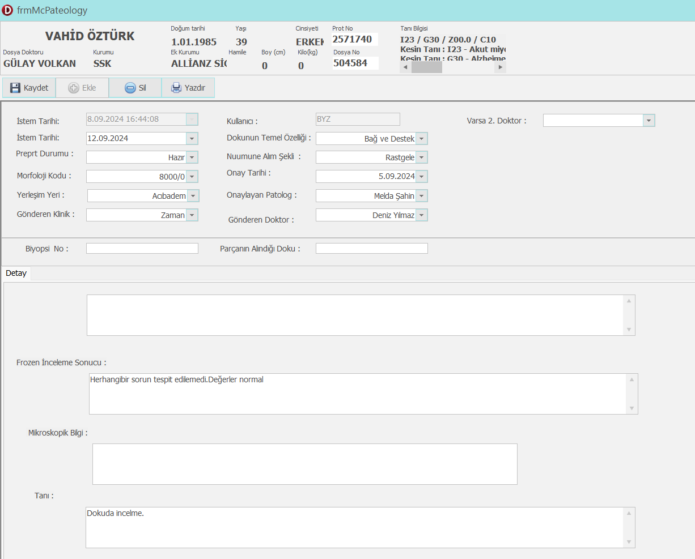

# 🧬 McPateology

A professional Delphi-based pathology form interface developed for clinical data management.  
This project contains both visual design (`.dfm`) and business logic (`.pas`) files.

---

## 📋 Features

- Patient and pathology form for internal clinical use  
- Integrated dropdowns for biopsy, doctor, date, tissue type, and more  
- Multi-line inputs for diagnosis, microscopic details, and frozen review  
- Oracle dataset binding support  
- Print, Save, and Add buttons built-in  
- Dual doctor field support (main and optional secondary)

---

## 🖼️ Interface Screenshot

> *If image is not visible, make sure `screenshot.png` is uploaded.*

---

## 📁 Files Included

| File              | Description               |
|-------------------|---------------------------|
| `McPateology.pas` | Source code (Delphi)      |
| `McPateology.dfm` | Form design (visual GUI)  |
| `screenshot.png`  | Form UI preview (image)   |

---

## 👤 Developer

Gamze Sefer – [GitHub Profile](https://github.com/gmzsefer)

📧 Contact: gamzesefer19@gmail.com  
